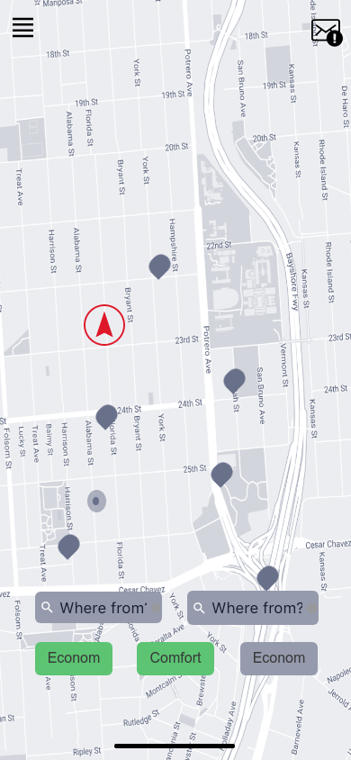
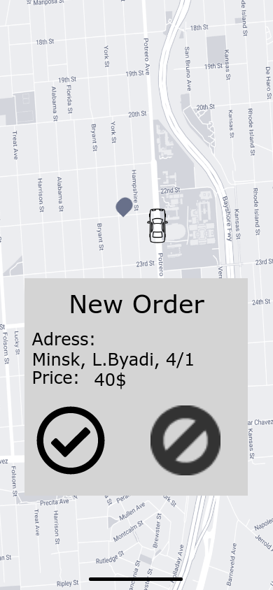
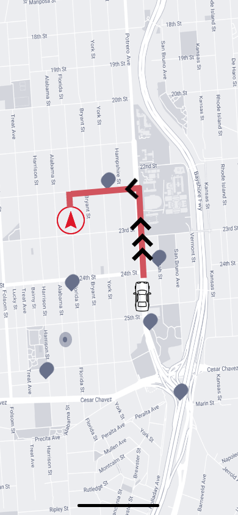

# Требования к проекту

---

[//]: # (TODO: ReWrite to SRS)
## Содержание

[1 Введение](#1-введение)  
[1.1 Назначение](#11-назначение)  
[1.2 Бизнес-требования](#12-бизнес-требования)  
[1.2.1 Исходные данные](#121-исходные-данные)  
[1.2.2 Возможности бизнеса](#122-возможности-бизнеса)  
[1.2.3 Границы проекта](#123-границы-проекта)  
[1.3 Аналоги](#13-аналоги)  
[2 Требования пользователя](#2-требования-пользователя) 
[2.1 Интерфейс пользователя](#22-интерфейс-пользователя)  
[2.2 Характеристики пользователей](#23-характеристики-пользователей)  
[2.2.1 Классы пользователей](#231-классы-пользователей)  
[2.2.2 Аудитория приложения](#232-аудитория-приложения)  
[2.2.2.1 Целевая аудитория](#2321-целевая-аудитория)  
[2.2.2.1 Побочная аудитория](#2322-побочная-аудитория)  
[2.3 Предположения и зависимости](#24-предположения-и-зависимости)  
[3 Системные требования](#3-системные-требования)  
[3.1 Функциональные требования](#31-функциональные-требования)  
[3.1.1 Основные функции](#311-основные-функции)  
[3.1.1.1 Вход пользователя в приложение](#3111-вход-пользователя-в-приложение)  
[3.1.1.2 Наличие уведомлений](#3112-наличие-уведомлений)  
[3.1.1.3 Изменение уведомлений](#3113-изменение-уведомлений)  
[3.1.1.4 Выход зарегистрированного пользователя из учётной записи](#3114-выход-зарегистрированного-пользователя-из-учётной-записи)  
[3.1.1.5 Регистрация нового пользователя после входа в приложение](#3115-регистрация-нового-пользователя-после-входа-в-приложение)  
[3.1.2 Ограничения и исключения](#312-ограничения-и-исключения)  
[3.2 Нефункциональные требования](#32-нефункциональные-требования)  
[3.2.1 Атрибуты качества](#321-атрибуты-качества)  
[3.2.1.1 Требования к удобству использования](#3211-требования-к-удобству-использования)  
[3.2.1.2 Требования к безопасности](#3212-требования-к-безопасности)  
[3.2.2 Внешние интерфейсы](#322-внешние-интерфейсы)  
[3.2.3 Ограничения](#323-ограничения)

# 1 Введение

## 1.1 Назначение

В этом документе будут описаны функциональные и нефункциональные требования к
мультиплатформенному приложению "DinoTaxi". Этот документ предназначен для
команды, которая будет реализовывать и проверять корректность работы приложения.

## 1.2 Бизнес-требования

### 1.2.1 Исходные данные

Такси в наше время является очень популярным и востребованным средством передвижения, особенно среди молодежи. Однако, многие сервисы по заказу такси являются перегруженными, либо же наоборот, имеют недостаточный функционал. Более того, многимм неудобно пользоваться именно приложениями, поскольку они занимают память в телефоне и затрудняют пользование, когда их становится слишком много. Существует действительно мало качественных сайтов по заказу такси, адаптированных под мобильную версию.

### 1.2.2 Возможности бизнеса

Большинство людей хотят иметь возможность мгновенного получения информации об
актуальном курсе валют, графиках колебания курса или же утечках, причём люди эти
могут быть абсолютно любого уровня технической грамотности. Подобное приложение
позволит им тратить намного меньше времени на поиск необходимой валюты, банка и
истории. Интерфейс, спроектированный с учётом этих особенностей, и своевременная
поддержка приложения позволят увеличить приток пользователей данного приложения
многократно. Будет прилагаться возможность ставить уведомления на курс
каких-то валют. При персональном аккаунте максимальное количество
уведомлений может достигать до 3 штук бесплатных и до 10 штук платных. При
бизнес-аккаунте ограничение на уведомления снимаются. Кроме этого, на нашем
сайте будет список всех актуальных криптовалют с их конвертацией в
государственные валюты.

### 1.2.3 Границы проекта

Приложение "DinoTaxi" позволит пользователям
заказать такси с одного адресса на другой, позволит просмотреть свои последние поездки, ставить рейтинг последней поездке, просмотреть свой общий рейтинг. Более того, сервис так же предоставляет сервис и для водителей, где они смогут принять заказ,поменять свой статус на свободен/занят, также просмотреть свои поездки, свой рейтинг и поставить оценку последней поездке.

## 1.3 Аналоги

Обзор аналогов приведён в
документе [Analogs](./Analogs.md).

# 2 Требования пользователя
 

## 2.1 Интерфейс пользователя

Заказ такси пользователем.

  
Новый заказ у водителя.

  
Маршрут для водителя.

## 2.2 Характеристики пользователей

### 2.2.1 Классы пользователей

| Класс пользователей             | Описание                                                                                                                        |
|:--------------------------------|:--------------------------------------------------------------------------------------------------------------------------------|
| Анонимные пользователи          | Пользователи, которые не хотят регистрироваться в приложении, не имеют доступа к приложению                          |
| Зарегистрированные пользователи | Пользователи, которые зарегестрировались в приложении и вошли в свой аккаунт имеют доступ к полному функционалу приложения |

### 2.2.2 Аудитория приложения

#### 2.2.2.1 Целевая аудитория

Люди любой возрастной категории, желающие воспользоваться услугами такси.

#### 2.2.2.2 Побочная аудитория

Люди, желающие стать водителями в данном сервисе.

## 2.3 Предположения и зависимости

1. Приложение не работает при отсутствии подключения к Интернету;
2. Приложение работает только для зарегестрированных пользователей;

# 3 Системные требования

## 3.1 Функциональные требования

### 3.1.1 Основные функции

#### 3.1.1.1 Регистрация пользователя
                                                                                                                                         | 
| Функция                                                               | Требования                                                                                                                                            | 
|:----------------------------------------------------------------------|:------------------------------------------------------------------------------------------------------------------------------------------------------|
                                                                        |
| <a name="registration_requirements"/>Регистрация нового пользователя. | Приложение должно запросить у пользователя ввести личные для создания учётной записи. Пользователь должен либо ввести данные, либо отменить действие. |
| *Пользователь с таким именем существует.*                             | *Приложение должно известить пользователя об ошибке регистрации и запросить ввод. Пользователь должен либо ввести псевдоним, либо отменить действие.* |
| Вход зарегистрированного пользователя в приложение.                   | Приложение направляет пользователя на вкладку личных уведомлений.                                                                                     |
#### 3.1.1.2 Наличие уведомлений

**Описание.** Зарегистрированный пользователь имеет возможность изменять
уведомления о курсе и ставить новые.

| Функция                | Требования                                                                            | 
|:-----------------------|:--------------------------------------------------------------------------------------|
| Добавление уведомлений | Приложение должно предоставить пользователю страницу с добавлением личных уведомлений |
| Изменение уведомлений  | Приложение должно предоставить пользователю страницу с изменением личных уведомлений  |

#### 3.1.1.3 Изменение уведомлений

**Описание.** После захода в сессию пользователь имеет возможность изменять
уведомления о курсе и выставлять новые

| Функция                   | Требования                                                                                                 | 
|:--------------------------          |:-------------------------------------------------------------------------------------------------|
| Заказ такси - пользователь          | Приложение предоставляет возможность изменять валюту, по которой ставится уведомление            |
| Изменение курса           | Приложение предоставляет возможность изменять количество валюты, по которой ставится уведомление |
| Изменить курс на обратный | Приложение предоставляет возможность быстро изменить курс валюты на противоположный.             |

#### 3.1.1.4 Выход зарегистрированного пользователя из учётной записи

**Описание.** Зарегистрированный пользователь имеет возможность выйти из учётной
записи.

**Требование.** Приложение должно предоставить зарегистрированному пользователю
возможность выйти из учётной записи с возвратом к окну входа в приложение.

#### 3.1.1.5 Регистрация нового пользователя после входа в приложение

**Описание.** Анонимный пользователь имеет возможность зарегистрироваться в
приложении.

**Требование.** Приложение должно предоставить анонимному пользователю
возможность [зарегистрироваться в приложении](#registration_requirements).

### 3.1.2 Ограничения и исключения

1. Приложение функционирует в полном наборе возможностей только при наличии
   подключения к Интернету;
2. Приложение может работать некорректно на неподходящем или слишком слабом
   аппаратном обеспечении или неподдерживаемых операционных системах.

## 3.2 Нефункциональные требования

### 3.2.1 Атрибуты качества

#### 3.2.1.1 Требования к удобству использования

1. Приложение должно не иметь перегруженного интерфейса;
2. Доступ к основным функциям должен быть интуитивно понятным для всех пользователей;

#### 3.2.1.2 Требования к безопасности

1. Приложение предоставляет возможности по заказу такси только для зарегестрированных пользователей
2. Для оплаты такси предприняты все меры для безопасности средств пользователей.

### 3.2.2 Внешние интерфейсы

Окна приложения удобны для использования продолжительное время:

* функциональные элементы не утомляют глаза.
* функциональные элементы линейно распределены по экрану.

### 3.2.3 Ограничения

1. Приложение реализовано на Golang и Js + React. 
2. Для хранения данных о пользователях, водителях и заказх будут использованы различные реляционные базы данных, такие как PostreSQL и Cassandra.
